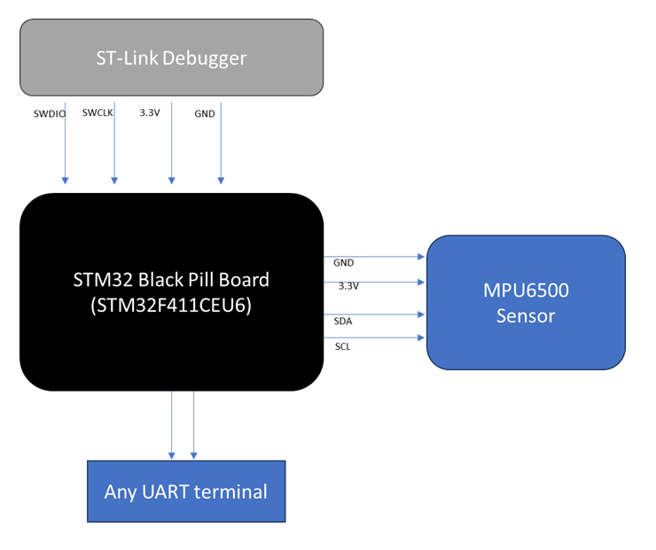

# STM32 Black Pill MPU6500 Driver Project

## Overview

This project helps you connect and use an **MPU6500 motion sensor** with an **STM32 Black Pill** development board. The MPU6500 is a small chip that can measure movement (acceleration) and rotation (gyroscope) in three directions. The STM32 Black Pill is a popular, affordable microcontroller board.

The code in this project is organized in a clear way to make it easy to understand and use, even if you are new to embedded programming. It does the following:

- **Talks to the sensor using I2C:** I2C is a common way for chips to communicate with each other using just two wires.
- **Reads data from the sensor:** The code can get acceleration and rotation values from the MPU6500.
- **Sends the data over UART:** The STM32 board sends the sensor data using UART (a serial communication method). If you have a UART-to-USB bridge (like an FTDI or CP2102 module), you can connect it to your computer and use any serial terminal program (like PuTTY, Tera Term, or Arduino Serial Monitor) to see the data.
- **Easy to expand:** You can add more features later, like reading temperature or using more advanced sensor functions.

This project is great for learning how to connect sensors to microcontrollers, how to organize your code, and how to see real sensor data using a serial terminal on your computer. You don’t need to use any special libraries for the sensor—everything is written from scratch and explained step by step.

---

## Features

- **No third-party MPU libraries:** All code is original and register-level.
- **Layered architecture:**  
  - Low-level: I2C register access (middleware)
  - High-level: Sensor configuration and data reading (driver)
- **Easy integration:** Just add your I2C/UART handles and call the API.
- **UART output:** Sensor data is printed for easy monitoring.
- **Extensible:** Add more features (temperature, interrupts, DMP, etc.) as needed.

---

## Block Diagram



## Devices Specifications

### STM32 Black Pill Board

- **Model:** STM32F401CEU6 (commonly called "Black Pill")
- **Description:**  
  The STM32 Black Pill is a small, affordable development board based on the STM32F4 series microcontroller. It features a 32-bit ARM Cortex-M4 processor running at up to 84 MHz, with 256 KB Flash and 64 KB RAM. The board is popular for hobby and learning projects because it is easy to use, has many input/output pins, and supports programming and debugging through a standard micro-USB or ST-Link interface.

- **Key Features:**
  - ARM Cortex-M4 core
  - 256 KB Flash, 64 KB RAM
  - Lots of GPIO pins
  - Supports I2C, UART, SPI, PWM, ADC, and more
  - Can be programmed using STM32CubeIDE or other tools


## Sensor Specifications

### MPU6500 6-Axis Motion Sensor

- **Description:**  
  The MPU6500 is a tiny sensor chip that combines a 3-axis accelerometer (measures movement) and a 3-axis gyroscope (measures rotation) in one package. It is commonly used in drones, robots, and smartphones to detect motion and orientation.

- **Key Features:**
  - 3-axis accelerometer (measures X, Y, Z movement)
  - 3-axis gyroscope (measures X, Y, Z rotation)
  - Communicates using I2C (used in this project) or SPI
  - Operates at 3.3V
  - Small and easy to connect to microcontroller boards

- **Typical Applications:**
  - Drones and quadcopters
  - Robotics
  - Game controllers
  - Smartphones and wearable devices
  


## Hardware Setup

- **MCU:** STM32F4 Black Pill (e.g., STM32F401CEU6)
- **Sensor:** MPU6500 (3.3V logic)
- **Programmer/Debugger:** ST-Link V2 (or similar)
- **USB-UART Adapter:** For viewing data on your computer

### Connections

- **MPU6500 SCL** → STM32 PB6 (I2C SCL)
- **MPU6500 SDA** → STM32 PB7 (I2C SDA)
- **MPU6500 VCC** → 3.3V
- **MPU6500 GND** → GND

- **STM32 PA2 (TX)** → USB-UART Adapter RX (for serial output)
- **STM32 PA3 (RX)** → USB-UART Adapter TX (optional)
- **STM32 GND** → USB-UART Adapter GND

- **ST-Link** connects to the STM32 Black Pill for programming and debugging (SWDIO, SWCLK, 3.3V, GND).

> Use the ST-Link to program the board, and a USB-UART adapter to see sensor data on your computer using any serial terminal (115200 baud).

---

## Project files

- **mpu6500_reg.h:** Register addresses and bitfields for MPU6500.
- **mpu6500_ll.h/c:** Low-level I2C register access using STM32 HAL.
- **mpu6500.h/c:** High-level driver for sensor configuration and data reading.
- **main.c:** Example application: initializes everything, reads sensor data, prints over UART.

---

## Usage

1. **Clone the repository:**
    ```sh
    git clone https://github.com/Lucky8882/MPU6500_BlackPill_driver
    ```

2. **Open in STM32CubeIDE.**

3. **Configure I2C and UART:**
    - Enable I2C (e.g., I2C1 on PB6/PB7).
    - Enable UART (e.g., USART2 on PA2/PA3).
    - Set UART baud rate to 115200.

4. **Build and flash the project** to your Black Pill board.

5. **Connect a USB-UART adapter** to your PC and open a serial terminal at 115200 baud.

6. **Observe output:**  
   The terminal will display real-time accelerometer and gyroscope data.

---

## Example Output

MPU6500 Example Start
WHO_AM_I: 0x70
MPU6500 detected! <br>
ACCEL: X=123 Y=-456 Z=789 | GYRO: X=12 Y=34 Z=-56
ACCEL: X=124 Y=-455 Z=790 | GYRO: X=13 Y=33 Z=-55
...


---

## Code Highlights

- **Low-level I2C access:**
    ```c
    HAL_StatusTypeDef mpu6500_write_reg(I2C_HandleTypeDef *hi2c, uint8_t reg, uint8_t data);
    HAL_StatusTypeDef mpu6500_read_reg(I2C_HandleTypeDef *hi2c, uint8_t reg, uint8_t *data);
    ```

- **High-level API:**
    ```c
    HAL_StatusTypeDef mpu6500_init(I2C_HandleTypeDef *hi2c);
    HAL_StatusTypeDef mpu6500_read_accel(I2C_HandleTypeDef *hi2c, mpu6500_axis_t *accel);
    HAL_StatusTypeDef mpu6500_read_gyro(I2C_HandleTypeDef *hi2c, mpu6500_axis_t *gyro);
    ```

- **Simple main loop:**
    ```c
    while (1) {
        mpu6500_read_accel(&hi2c1, &accel);
        mpu6500_read_gyro(&hi2c1, &gyro);
        uart_printf("ACCEL: X=%d Y=%d Z=%d | GYRO: X=%d Y=%d Z=%d\r\n",
            accel.x, accel.y, accel.z, gyro.x, gyro.y, gyro.z);
        HAL_Delay(200);
    }
    ```

---
## Credits

- [MPU-6500 Datasheet](https://invensense.tdk.com/wp-content/uploads/2015/02/MPU-6500-Datasheet1.pdf)
- STM32 HAL and STM32CubeIDE
---
